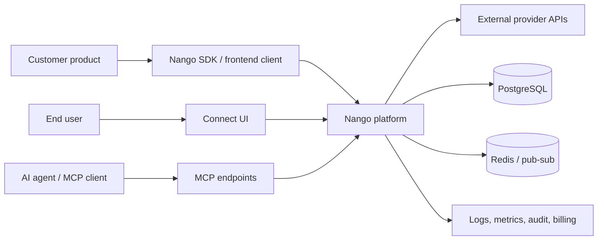
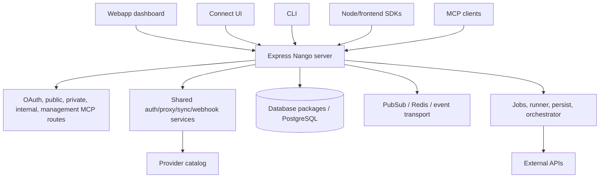
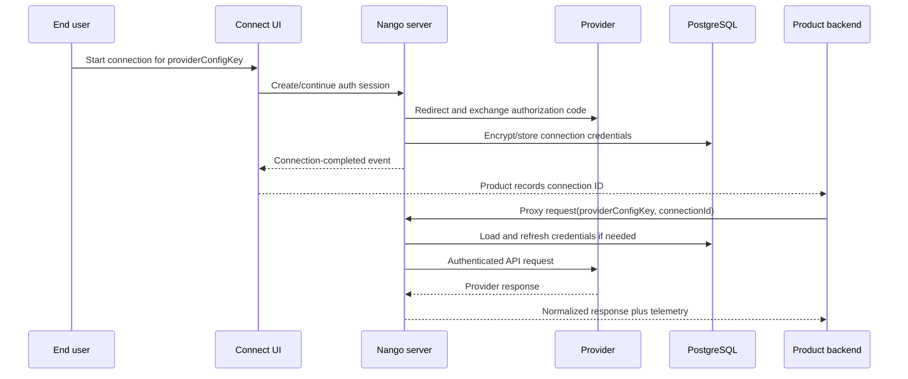
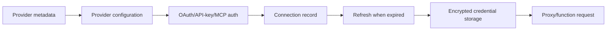

# Nango Architecture and Operations Guide

> **Scope and evidence.** This document describes the checkout at the time it was
> written. Claims are grounded in local files, not a remote deployment. The
> current branch/commit identity could not be re-read after the sandbox blocked
> shell access, so treat the exact commit as **[UNVERIFIED]** and record it with
> `git branch --show-current` and `git log -1` before using this as a release
> runbook.

## 1. Executive summary

Nango is an integration platform: it turns many third-party APIs into a
controlled capability inside a product. The business problem is not merely
"make an HTTP request"; it is safely handling OAuth/API-key authentication,
credential storage and refresh, tenant isolation, retries/rate limits, sync
state, webhooks, custom integration code, and AI/MCP tool access. The repository
implements those capabilities as a TypeScript monorepo with a central Express
server, shared domain packages, a PostgreSQL persistence layer, optional Redis
and event transports, a provider catalog, a web dashboard, an embeddable Connect
UI, a CLI, SDKs, and worker-style packages. The README explicitly groups the
product into Auth, Proxy, and Functions, and lists syncs, webhooks, unified APIs,
actions, customer configuration, and AI tool calling as supported use cases
([README.md](README.md#L19-L93)).

The repository's implementation workflow is documented separately in
[AGENTIC_DEVELOPMENT.md](AGENTIC_DEVELOPMENT.md). That handbook is an
IDE-neutral process for mapping, changing, testing, reviewing, and recording
work; it does not add a runtime component or replace the architecture described
here.

## 2. Business purpose and alternatives

### Problems solved

| Business problem | Nango capability | Why it matters |
|---|---|---|
| Every customer has different OAuth details | Provider metadata plus shared OAuth clients | Product teams avoid implementing hundreds of authorization-code flows. |
| Credentials are sensitive and expire | Encrypted connection storage and refresh logic | The product can act on behalf of a tenant without exposing long-lived secrets. |
| APIs disagree on shape and reliability | Proxy, retries, rate limits, provider-specific functions | A stable internal contract hides vendor differences. |
| Integrations need ongoing data movement | Sync functions, checkpoints, records, schedules | RAG, indexing, reporting, and triggers can be incremental rather than full imports. |
| External systems call back asynchronously | Webhook routes and webhook processing | Changes are received instead of repeatedly polled. |
| AI agents need safe external actions | MCP registration, management MCP routes, and tool-facing functions | Agents can use connected systems without receiving raw credentials. |
| Integration code must be operated | CLI, logs, telemetry, audit, feature flags, and deploy workflows | Teams can review, deploy, observe, and roll back integration behavior. |

### Alternatives and when they fit

| Alternative | Prefer it when | Trade-off versus Nango |
|---|---|---|
| Build each integration in the product backend | Only a few providers, simple API keys, and no shared integration lifecycle | Lowest platform overhead, but auth, refresh, retries, and provider drift become product code. |
| Use a vendor-only unified API | You only need the vendor's normalized resources | Faster initial adoption, but less control over custom actions, source code, and self-hosting. |
| Use direct SDKs/provider libraries | One provider is strategically important | Excellent provider depth, but no multi-provider abstraction or shared connection lifecycle. |
| Use an event bus plus bespoke workers | Existing platform already has mature identity, workflow, and observability primitives | Flexible, but the team owns every connector's auth and failure semantics. |
| Nango Cloud/BYOC/self-hosting | You want Nango's integration primitives with different operational ownership | Cloud reduces operations; self-hosting keeps data/infrastructure under your control. |

## 3. Technical stack

| Layer | Technology | Evidence |
|---|---|---|
| Language/runtime | TypeScript, Node.js >=20; repository pin Node 22.22.2 | [package.json](package.json#L1-L8), [package.json](package.json#L100-L102), [.nvmrc](.nvmrc#L1) |
| Backend | Express HTTP server, WebSockets, cron jobs | [packages/server/lib/server.ts](packages/server/lib/server.ts#L1-L41), [packages/server/lib/server.ts](packages/server/lib/server.ts#L42-L116) |
| Frontend | React/Vite workspaces for webapp and Connect UI | [packages/webapp/package.json](packages/webapp/package.json#L1-L80), [packages/connect-ui/package.json](packages/connect-ui/package.json#L1-L80) |
| Persistence | PostgreSQL through Knex and domain packages | [packages/server/lib/server.ts](packages/server/lib/server.ts#L16-L18), [packages/server/lib/migrate.ts](packages/server/lib/migrate.ts#L1-L17) |
| Cache/transport | Redis is part of local Docker; pub/sub transport is initialized by the server | [docker-compose.yaml](docker-compose.yaml#L70-L87), [packages/server/lib/server.ts](packages/server/lib/server.ts#L88-L96) |
| Provider catalog | YAML provider definitions and scopes | [packages/providers/providers.yaml](packages/providers/providers.yaml), [packages/providers/providers.scopes.yaml](packages/providers/providers.scopes.yaml) |
| API contract | OpenAPI spec and generated LLM indexes | [docs/spec.yaml](docs/spec.yaml), [.github/workflows/validation.yaml](.github/workflows/validation.yaml#L68-L92) |
| Testing | Vitest unit/integration/CLI suites, Playwright Connect UI tests | [package.json](package.json#L48-L56), [.github/workflows/tests.yaml](.github/workflows/tests.yaml#L75-L133) |
| Quality | oxlint, Prettier, TypeScript project builds, Husky | [package.json](package.json#L10-L17), [CONTRIBUTING.md](CONTRIBUTING.md#L1-L8) |
| Packaging | npm workspaces and committed package lockfile | [package.json](package.json#L1-L9), [package-lock.json](package-lock.json) |

## 4. Repository map

| Area | Responsibility |
|---|---|
| `packages/server` | Public/private/internal HTTP APIs, OAuth server, management MCP, cron, migration startup, WebSockets. |
| `packages/shared` | Shared services and clients: OAuth, proxy requests, sync/webhook primitives, auth utilities, logging, policy. |
| `packages/database` | Knex database access and migrations. |
| `packages/providers` | Provider definitions, scopes, validation, generated provider metadata. |
| `packages/jobs` | Function/job execution and processing. |
| `packages/runner` | Runtime used to execute integration code and expose the SDK. |
| `packages/persist` | Persistence-facing service process and storage services. |
| `packages/orchestrator` | Scheduling/orchestration service. |
| `packages/metering`, `packages/usage`, `packages/billing` | Usage, metering, and optional commercial integrations. |
| `packages/webapp` | Operator dashboard. |
| `packages/connect-ui` | Embeddable end-user authorization UI. |
| `packages/node-client`, `packages/frontend`, `packages/runner-sdk` | Public client and runtime SDKs. |
| `packages/cli` | `nango` developer/deployment CLI. |
| `packages/records`, `packages/logs`, `packages/keystore`, `packages/kvstore`, `packages/audit` | Specialized persistence, logs, key storage, key/value data, and audit concerns. |
| `docs` | User documentation, OpenAPI, integration catalog, snippets, and generated indexes. |
| `.github/workflows` | CI, Docker validation, publishing, provider validation, client tests, and deployment automation. |

## 5. Runtime and deployment surface

### Self-hosted Docker topology

The root `docker-compose.yaml` defines:

* `nango-db`: PostgreSQL 16 Alpine, bind-mounted to `./nango-data`.
* `nango-redis`: Redis 7.2.4.
* `nango-server`: the image selected by `NANGO_IMAGE` (defaulting to the
  published `nangohq/nango-server:hosted` image), exposing
  API port 3003 and Connect UI port 3009, and mounting provider metadata.
* An optional Elasticsearch service is documented but commented out.

Evidence: [docker-compose.yaml](docker-compose.yaml#L1-L87).

The Compose file now uses a PostgreSQL health check and makes `nango-server`
wait for healthy PostgreSQL and Redis services. It intentionally does not set
fixed `container_name` values, because fixed names collide when the same
project is started from different folders. Database and Redis bind to
localhost by default, while the HTTP ports remain available for an ingress.
See [self-hosted-production.md](docs/self-hosted-production.md) for the
production runbook.mportant because Compose service start
order is not database readiness. Redis has a ping health check as well
([docker-compose.yaml](docker-compose.yaml#L12-L21), [docker-compose.yaml](docker-compose.yaml#L58-L68)).

The server image itself is a multi-process container when
`FLAG_SERVE_CONNECT_UI=true`: `entrypoint.sh` starts the Node server, serves the
Connect UI static build on port 3009, and exits when either process exits
([packages/server/entrypoint.sh](packages/server/entrypoint.sh#L1-L26)).

### Development Docker topology

`npm run dev:docker` starts the dependency stack described by
`dev/docker-compose.dev.yaml`: PostgreSQL 15.5, Redis, Elasticsearch,
ActiveMQ, and ClickHouse. The application processes are then run from Node
watch commands, not from the Compose file ([package.json](package.json#L79-L80),
[dev/docker-compose.dev.yaml](dev/docker-compose.dev.yaml#L1-L88)).

### Build/runtime pins

| Surface | Pin |
|---|---|
| Local Node | `.nvmrc` = 22.22.2 |
| Production build image | `node:22.22.2-bookworm-slim` in [Dockerfile](Dockerfile#L10-L10) |
| Production runtime image | `node:22.22.2-bookworm-slim` in [Dockerfile](Dockerfile#L70-L70) |
| Self-hosted image | `nangohq/nango:${BASE_IMAGE_HASH}` in [Dockerfile.self_hosted](Dockerfile.self_hosted#L1-L8) |
| CI client matrix | Node 20.x, 22.x, 24.x in [.github/workflows/tests-clients.yaml](.github/workflows/tests-clients.yaml#L58-L64) |
| Compose DB/cache | PostgreSQL 16.0 and Redis 7.2.4 in [docker-compose.yaml](docker-compose.yaml#L2-L7), [docker-compose.yaml](docker-compose.yaml#L70-L72) |
| Dev DB/cache | PostgreSQL 15.5 and Redis 7.2.4 in [dev/docker-compose.dev.yaml](dev/docker-compose.dev.yaml#L2-L7), [dev/docker-compose.dev.yaml](dev/docker-compose.dev.yaml#L11-L14) |

The PostgreSQL major version differs between development and self-hosted
Compose. That may be intentional, but it is a compatibility surface to test
before using the self-hosted volume as a development fixture. A database image
tag change is not a data migration; preserve a backup and use a PostgreSQL
supported upgrade path for data that matters.

## 6. Commands and verification inventory

| Command | Purpose | Evidence |
|---|---|---|
| `npm install` then `npm run prepare` | Install dependencies and Husky hooks | [DEVELOPMENT.md](DEVELOPMENT.md#L5-L13) |
| `npm run dev:docker` | Start local backing services | [package.json](package.json#L79-L80) |
| `npm run dev:watch` | TypeScript watch build | [package.json](package.json#L35-L37) |
| `npm run dev:watch:apps` | Run server, webapp, jobs, persist, orchestrator, metering, Connect UI | [package.json](package.json#L38-L45) |
| `npm run dev:watch:web` | Run server plus web surfaces | [package.json](package.json#L45-L47) |
| `npm run ts-build` | Full TypeScript project build | [package.json](package.json#L17-L18) |
| `npm run ts-build:docker` | Docker-specific TypeScript build | [package.json](package.json#L17-L18) |
| `npm run lint` | oxlint | [package.json](package.json#L10-L11), [CONTRIBUTING.md](CONTRIBUTING.md#L10-L14) |
| `npm run format:check` | Prettier check | [package.json](package.json#L12-L13) |
| `npm run test:unit -- packages/<area>` | Focused unit tests | [package.json](package.json#L48-L50) |
| `npm run test:integration -- --shard=1/4` | One integration shard | [package.json](package.json#L49-L50), [.github/workflows/tests.yaml](.github/workflows/tests.yaml#L93-L110) |
| `npm run test:cli` | CLI suite | [package.json](package.json#L50-L52) |
| `npm run test:openapi` | Swagger validation and Redocly lint | [package.json](package.json#L55-L55) |
| `npm run test:providers` | Provider YAML validation | [package.json](package.json#L73-L74) |
| `npm run connect-ui:build` | Build Connect UI | [package.json](package.json#L31-L32) |
| `npm run docker-build:unified` | Build the unified Docker image | [package.json](package.json#L20-L21) |
| `npm run docs:generate:llms` | Regenerate documentation indexes | [package.json](package.json#L66-L68) |

CI runs lint/format/typecheck, unit/integration tests, client tests, Docker
database-health/readiness checks, provider/OpenAPI/docs validation, and
publishing checks. The
workflows run on pull requests, pushes to `master`/`staging/**`, and merge
queues, with path-based skips for docs-only changes
([.github/workflows/lint.yaml](.github/workflows/lint.yaml#L1-L12),
[.github/workflows/tests.yaml](.github/workflows/tests.yaml#L1-L13),
[.github/workflows/docker.yaml](.github/workflows/docker.yaml#L69-L107)).
Whether these checks are configured as required branch-protection checks is
**[UNVERIFIED]** from the checkout; confirm in repository settings.

## 7. Architectural blueprint

### C4 level 1: system context

### C4 level 2: containers

The route order is significant: unauthenticated health/config/provider routes
come first, OAuth and MCP are mounted before private APIs, the public API has
no prefix, and the dashboard static fallback is mounted last
([packages/server/lib/routes.ts](packages/server/lib/routes.ts#L21-L56)).

### C4 level 3: representative OAuth-to-proxy lifecycle

## 8. Cross-cutting concerns

| Concern | Implementation |
|---|---|
| Authentication | OAuth/API-key/provider-specific auth in shared clients; dashboard/basic auth flags in environment configuration. |
| Credential safety | Encryption key is required for encrypted credentials and Connect UI sessions; OAuth refresh validates outbound URLs ([.env.example](.env.example#L1-L8), [packages/shared/lib/clients/oauth2.client.ts](packages/shared/lib/clients/oauth2.client.ts#L35-L53)). |
| SSRF protection | Proxy and OAuth outbound policy variables deny metadata/loopback targets by default ([.env.example](.env.example#L35-L47)). |
| Configuration | Environment variables are loaded before server startup; `.env.example` documents public URLs, DB, logs, flags, OAuth, telemetry, and optional services. |
| Logging/tracing | Server tracer/logger, provider HTTP telemetry, logs package, and optional OTLP registration ([packages/server/lib/server.ts](packages/server/lib/server.ts#L1-L3), [packages/server/lib/server.ts](packages/server/lib/server.ts#L94-L95)). |
| Error handling | Express final error middleware maps invalid JSON, oversized entities, proxy content types, and generic errors ([packages/server/lib/routes.ts](packages/server/lib/routes.ts#L58-L87)). |
| Feature flags | Feature flags are initialized during server startup and destroyed during shutdown ([packages/server/lib/server.ts](packages/server/lib/server.ts#L8-L9), [packages/server/lib/server.ts](packages/server/lib/server.ts#L139-L146)). |
| Audit | Audit DB migration and partition startup are part of server lifecycle ([packages/server/lib/server.ts](packages/server/lib/server.ts#L52-L61), [packages/server/lib/migrate.ts](packages/server/lib/migrate.ts#L11-L15)). |
| Health | `/health` is process-level; `/ready` is readiness-oriented and should be preferred by a load balancer ([packages/server/lib/routes.ts](packages/server/lib/routes.ts#L25-L29)). |

## 9. Complex subsystem deep-dives

### 9.1 Provider/auth and connection lifecycle

Provider YAML describes authorization metadata. The server uses provider config,
team/environment context, and a connection record to create OAuth clients. The
OAuth client constructs provider-specific token URLs, applies safe HTTP agents,
refreshes tokens, redacts secrets from telemetry, and returns an application
error rather than leaking provider credentials
([packages/shared/lib/clients/oauth2.client.ts](packages/shared/lib/clients/oauth2.client.ts#L35-L113)).
MCP OAuth providers can dynamically register a client using the environment
callback URL and team/environment/provider identity
([packages/shared/lib/clients/mcp.client.ts](packages/shared/lib/clients/mcp.client.ts#L14-L48)).

**Operational rule:** rotate `NANGO_ENCRYPTION_KEY` only with an explicit
credential re-encryption plan. The example configuration warns that changing
the key after credentials are encrypted is not safe
([.env.example](.env.example#L1-L8)).

### 9.2 Proxy and custom function execution

The product backend sends a request to Nango with a provider configuration and
connection identity. Nango resolves credentials, applies provider URL and
security policy, performs the external request, and records logs/metrics. For
custom behavior, the function runtime exposes the Nango SDK to integration code;
the README's function example shows a function receiving `nango.input` and
calling `nango.post` against an external API ([README.md](README.md#L51-L67)).
The jobs and runner packages provide the execution boundary, while shared
services provide common auth, HTTP, storage, and telemetry.

Use proxy for direct, mostly-compatible provider calls. Use an action/function
when you need transformations, pagination, multi-call orchestration, writes,
or a durable business operation.

### 9.3 Syncs, webhooks, events, and MCP

Syncs are durable, repeatable data movement; they should checkpoint progress
and expose a cursor/state boundary. Webhooks are the inverse trigger: the
provider calls Nango, Nango authenticates/verifies and dispatches processing,
and the integration updates local state. Pub/sub and job services decouple
request latency from background work. MCP adds a capability-discovery and
authorization surface for agents; it should call the same connection and
policy services rather than bypassing them.

The server initializes pub/sub, starts task processing and cron jobs, and
registers OTLP routes before listening
([packages/server/lib/server.ts](packages/server/lib/server.ts#L84-L103)).
The route registry mounts a dedicated management MCP router separately from the
ordinary public/private APIs ([packages/server/lib/routes.ts](packages/server/lib/routes.ts#L31-L38)).

## 10. Startup, migration, and shutdown

At startup the server:

1. Loads tracing and environment configuration.
2. Builds the Express/WebSocket server.
3. Runs database, keystore, logs, records, fleet, tasks, and audit migrations
   when `NANGO_MIGRATE_AT_START=true`.
4. Starts audit partitions, provider preload, refresh/timeout/cleanup/trial
   crons, tasks, telemetry, pub/sub, and feature flags.
5. Listens on the configured port.

Evidence: [packages/server/lib/server.ts](packages/server/lib/server.ts#L1-L18),
[packages/server/lib/server.ts](packages/server/lib/server.ts#L42-L103).

`packages/server/lib/migrate.ts` is the one-shot migration entry point for
operators who disable startup migrations in a multi-replica deployment
([packages/server/lib/migrate.ts](packages/server/lib/migrate.ts#L1-L17)).

On SIGTERM, the server stops accepting work, waits the configured shutdown
delay, closes WebSockets, fleets, tasks, DB/records/logs, telemetry, pub/sub,
and flushes metrics ([packages/server/lib/server.ts](packages/server/lib/server.ts#L105-L155)).

## 11. End-to-end playbooks

### Playbook A: start local development

1. Use Node 22.22.2 (`.nvmrc`).
2. Run `npm install`, then `npm run prepare`.
3. Copy `.env.example` to `.env`; set a stable local encryption key.
4. Run `npm run dev:docker`.
5. In terminal one run `npm run dev:watch`.
6. In terminal two run `npm run dev:watch:apps` (or the narrower web/headless command).
7. Open the dashboard on port 3000, API on 3003, and Connect UI on 3009.
8. Check `/health` and `/ready` before testing an integration.

This sequence is prescribed by [DEVELOPMENT.md](DEVELOPMENT.md#L5-L30).

### Playbook B: start self-hosted Docker

1. Create `.env` with `NANGO_ENCRYPTION_KEY`, DB settings, server URLs, and
   dashboard auth values.
2. Ensure `./nango-data` is writable by Docker and back it up before upgrades.
3. Run `docker compose config` to inspect interpolated values.
4. Run `docker compose up -d`.
5. Run `docker compose ps` and inspect `docker compose logs nango-db
   nango-server`.
6. Wait for DB health, then verify `http://localhost:3003/health`,
   `http://localhost:3003/ready`, and the Connect UI on port 3009.
7. If the server reports `ENOTFOUND nango-db`, inspect both containers'
   network attachments and recreate the stack; the services must share the
   Compose `nango` network. Do not replace `nango-db` with `localhost` inside
   the server container.
8. If a data directory contains a prior PostgreSQL major version, stop and
   perform a supported PostgreSQL upgrade/backup procedure; do not treat an
   image tag change as sufficient.

### Playbook C: add a new provider/API

1. Confirm the provider's auth model, scopes, pagination, rate limits, webhook
   semantics, and data model.
2. Add provider metadata and scopes under `packages/providers`.
3. Add or update the integration function/sync/action.
4. Add tests at the seam: auth callback, token refresh, proxy request, sync
   cursor, webhook signature, or action response.
5. Run `npm run test:providers`, focused unit tests, `npm run test:openapi` if
   the API surface changed, `npm run lint`, and `npm run format:check`.
6. Update generated docs/indexes with `npm run docs:generate:llms` when required.
7. Deploy through the CLI workflow: configure the environment, set
   `NANGO_SECRET_KEY_DEV` and `NANGO_HOSTPORT`, then use `nango deploy dev`
   ([DEVELOPMENT.md](DEVELOPMENT.md#L32-L45)).

### Playbook D: expose an existing API through a new feature

1. Choose the smallest stable seam: proxy, action/function, sync, webhook, or MCP tool.
2. Reuse connection lookup, credential refresh, outbound URL policy, rate
   limiting, and telemetry; do not create a second credential path.
3. Define tenant identity and authorization before implementing the provider call.
4. Make retries/idempotency explicit. External writes need an idempotency key or
   a durable operation record.
5. Add an OpenAPI route/schema if the feature is public.
6. Add a unit test, an integration test when persistence/transport is involved,
   and an operator-facing failure mode.
7. Update docs and generated indexes in the same change.

### Playbook E: webhook-to-sync reaction

1. Register the provider webhook endpoint and secret.
2. Verify the signature before parsing or enqueueing business work.
3. Persist a deduplication key/event ID.
4. Publish a normalized event or enqueue a job.
5. Have the sync/action processor load the connection and refresh credentials if
   necessary.
6. Apply the state change idempotently.
7. Emit audit/log/metric data with tenant, provider, connection, event, and
   operation identifiers.
8. Retry transient provider/transport errors; dead-letter or surface permanent
   failures for operators.

### Playbook F: MCP/AI tool call

1. Register or configure the MCP provider/client and redirect URI.
2. Authorize a tenant connection using the same credential store as non-MCP flows.
3. Expose a narrow tool contract with typed input and output.
4. Enforce tenant, user, provider, and outbound URL policy before execution.
5. Apply timeouts, rate limits, redaction, and idempotency for writes.
6. Return actionable errors to the agent without returning secrets.
7. Record audit and tool-call telemetry.

## 12. Common failure modes and diagnosis

| Symptom | Likely cause | First checks |
|---|---|---|
| Compose warns `version` is obsolete | Legacy Compose key | Remove `version`; it is not a runtime failure. |
| `getaddrinfo ENOTFOUND nango-db` | Server and DB are not on the same network, stale containers, or startup/recreate race | `docker compose ps`, inspect both network attachments, recreate the stack; keep DB host as `nango-db`. |
| DB says “database system was not properly shut down” | Previous container/process stopped abruptly | Let PostgreSQL finish WAL recovery; investigate host shutdown/storage health if repeated. |
| Billing no-op warning | `ORB_API_KEY` absent | Expected for local/self-hosted; configure Orb only if billing is required. |
| Audit events dropped | No audit backend configured | Configure the audit backend if compliance/audit history is required. |
| OAuth refresh fails | Bad provider metadata, expired/revoked refresh token, or outbound policy block | Inspect provider config, connection state, redacted HTTP telemetry, and outbound policy. |
| Server starts but requests fail | `/ready` false, migrations incomplete, or backing transport unavailable | Check readiness, migration logs, DB/Redis/optional service health. |
| Dashboard works but Connect UI does not | `FLAG_SERVE_CONNECT_UI`, port, or `NANGO_PUBLIC_CONNECT_URL` mismatch | Check entrypoint, port 3009, and browser-visible URL. |

## 13. Security and operational guardrails

* Never commit `.env`, provider client secrets, encryption keys, or connection
  credentials.
* Treat `NANGO_ENCRYPTION_KEY` as permanent key material; plan rotation rather
  than changing it casually.
* Keep SSRF protections enabled unless a narrowly scoped exception is reviewed.
* Put TLS and authentication at the edge for self-hosting; do not expose
  PostgreSQL/Redis publicly.
* Use `/ready` for traffic admission and `/health` for process liveness.
* Back up PostgreSQL before migrations or image-major changes.
* Enable audit/log backends when the deployment has compliance or incident
  response requirements.
* Prefer separate production and development provider credentials and callback
  URLs.

## 14. Confidence assessment

| Area | Confidence | Reason |
|---|---|---|
| Repository purpose and primitives | High | Directly stated in README. |
| HTTP route families and startup order | High | Read directly from server/routes source. |
| Docker services, ports, health checks | High | Read directly from Compose files. |
| Provider/OAuth lifecycle | High for shared OAuth code; broader provider-specific behavior is inferred | Provider catalog is data-driven and varies by provider. |
| Jobs/runner/persist topology | Inferred | Package boundaries and local skill docs identify these processes; every execution path was not exhaustively read. |
| Production CI enforcement | Unverified | Workflows are present, but branch-protection settings are remote repository configuration. |
| Current deployed version/image digest | Unverified | Self-hosted Compose intentionally uses the mutable `hosted` tag. |
| Docker network failure root cause in a future run | Inferred | The documented diagnosis follows the observed DNS symptom; inspect live network attachments before declaring a specific cause. |

## 15. Footnotes: key local sources

* [README.md](README.md) — product purpose, primitives, use cases, and quickstart.
* [DEVELOPMENT.md](DEVELOPMENT.md) — local installation and two-terminal workflow.
* [package.json](package.json) — workspace boundaries and canonical commands.
* [docker-compose.yaml](docker-compose.yaml) — self-hosted runtime topology.
* [dev/docker-compose.dev.yaml](dev/docker-compose.dev.yaml) — development backing services.
* [Dockerfile](Dockerfile) — production build/runtime image and Node pin.
* [Dockerfile.self_hosted](Dockerfile.self_hosted) — self-hosted image customization.
* [.env.example](.env.example) — configuration, security, URLs, optional integrations.
* [packages/server/lib/server.ts](packages/server/lib/server.ts) — server lifecycle.
* [packages/server/lib/routes.ts](packages/server/lib/routes.ts) — route composition and error handling.
* [packages/server/lib/migrate.ts](packages/server/lib/migrate.ts) — one-shot migrations.
* [packages/shared/lib/clients/oauth2.client.ts](packages/shared/lib/clients/oauth2.client.ts) — OAuth refresh and outbound policy.
* [packages/shared/lib/clients/mcp.client.ts](packages/shared/lib/clients/mcp.client.ts) — MCP OAuth client registration.
* [.github/workflows/tests.yaml](.github/workflows/tests.yaml) — unit/integration/Connect UI gates.
* [.github/workflows/lint.yaml](.github/workflows/lint.yaml) — lint, format, and typecheck gates.
* [.github/workflows/docker.yaml](.github/workflows/docker.yaml) — Docker database-health and server-readiness verification.
* [.github/workflows/validation.yaml](.github/workflows/validation.yaml) — provider, OpenAPI, and docs validation.
